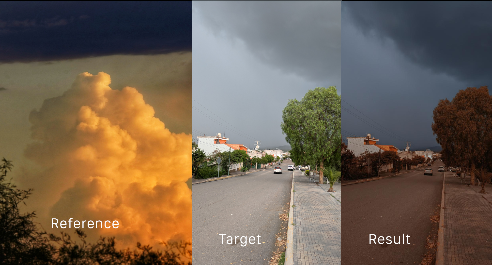

# Color Style Transfer

Apply the color palette of one image to another using style transfer powered by generative AI.

- Model used: gemini-2.5-flash-image-preview (AKA Nano Banana 🍌)


### Setup

1. Create .venv with python +3.10

```shell
python3 -m venv .venv
```

2. Activate venv

3. Run

```shell
make run
```

Note: If you're using Windows and have issues running Makefiles commands, try running:

```shell
streamlit run app.py
```

### Example



